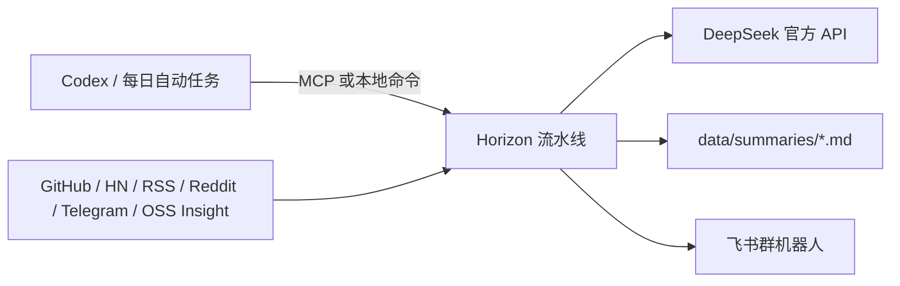

# Horizon + DeepSeek AI 信息雷达设计

## 目标

在本机部署 Horizon，面向 AI 软件工程师持续收集高信噪比信息。Codex 负责交互式操作和定时编排，Horizon 负责抓取、去重、评分、补充背景、生成中文日报，并把同一份结果保存为本地 Markdown、推送到飞书。

首版追求可用、低维护和密钥最少化，不引入 Twitter/Apify、邮件、GitHub Pages、OpenBB 或自定义代码。

## 已确认的选择

| 项目 | 选择 |
| --- | --- |
| AI 服务 | DeepSeek 官方 API |
| API 地址 | `https://api.deepseek.com` |
| 模型 | `deepseek-v4-flash` |
| Codex 集成 | Horizon 内置 MCP Server |
| 主要语言 | 中文 |
| 输出 | 本地 Markdown + 飞书折叠卡片 |
| 运行频率 | 每天 08:30，`Asia/Shanghai` |
| 部署方式 | 本地 `uv` 环境 |

DeepSeek 官方文档当前列出 `deepseek-v4-flash`；Horizon 当前仓库也提供了相同模型的 DeepSeek 配置示例。

## 系统边界

Codex 不充当 Horizon 的模型后端，也不把 Codex 登录凭据传给 Horizon。Horizon 只从本机 `.env` 读取 DeepSeek Key 和飞书 Webhook；Codex 通过 MCP 或 `uv run horizon` 触发流水线。

## 运行时文件

以下运行时文件均已被上游 `.gitignore` 排除：

- `.env`：仅保存 `DEEPSEEK_API_KEY`、`HORIZON_WEBHOOK_URL`，以及可选的 `GITHUB_TOKEN`。
- `data/config.json`：保存非敏感的模型、信息源、过滤和输出配置。
- `data/summaries/*.md`：每日中文日报。
- `data/mcp-runs/`：MCP 分阶段运行产物。

密钥不会写入 `data/config.json`、Codex 配置、日志、设计文档或 Git 提交。用户不在聊天中粘贴密钥；实施阶段通过本机终端的静默输入写入 `.env`。

## 信息源设计

首版采用不需要额外密钥的核心来源：

- GitHub：关注代表性研究者动态，以及 Codex、Agents SDK、MCP、vLLM、SGLang 等项目发布。
- Hacker News：捕捉高讨论度的模型、Agent、开发工具与安全事件。
- RSS：保留少量高密度技术作者、AI 工程和半导体/基础设施来源。
- Reddit：`MachineLearning`、`LocalLLaMA`，用于发现社区实践和开源模型信号。
- Telegram：保留中文 AI 资讯补充源。
- OSS Insight：发现 Python、TypeScript、Rust 中快速上升的开源项目。

首版不启用 Twitter/X，避免引入 Apify Token、额外成本和较高噪声。后续只有在连续复盘发现明显漏报时才增加来源。

## AI 与过滤策略

DeepSeek 配置采用：

- `provider: deepseek`
- `model: deepseek-v4-flash`
- `base_url: https://api.deepseek.com`
- `api_key_env: DEEPSEEK_API_KEY`
- `languages: [zh]`
- `max_tokens: 8192`
- `temperature: 0.3`
- `analysis_concurrency: 3`
- `enrichment_concurrency: 2`
- `throttle_sec: 1`

首版过滤阈值设为 `7.5`，每期最多保留 15 条。目标是日报可在十分钟内读完，同时为 Agent、Coding、MCP、安全和开发效率类信号保留足够覆盖。运行一周后再依据“入选但不值得读”和“漏掉但值得读”的案例调整阈值与来源，不提前构建复杂评分体系。

## 输出与飞书

Horizon 始终先生成本地 Markdown，再尝试发送飞书。飞书配置采用：

- `platform: feishu`
- `layout: collapsible`
- `delivery: summary_and_items`
- `overview_position: last`
- `languages: [zh]`

飞书失败不能删除或覆盖本地日报；本地 Markdown 是每次运行的持久结果。Webhook URL 只通过 `HORIZON_WEBHOOK_URL` 注入。

## Codex 与定时运行

项目级 Codex 配置注册名为 `horizon` 的 stdio MCP Server，启动命令为 `uv run horizon-mcp`，工作目录固定为当前 Horizon 仓库根目录。

完成一次真实手动运行后，再创建每天 08:30 的 Codex 自动任务。自动任务只执行以下稳定流程：

1. 在 Horizon 根目录运行最近 24 小时的信息采集。
2. 验证生成了非空中文 Markdown。
3. 检查飞书推送结果。
4. 成功时返回摘要路径，失败时保留本地产物并报告具体阶段。

不在验证之前创建定时任务，避免每天重复运行一个未完成的配置。

## 失败处理

- 缺少 DeepSeek Key 或 Webhook：配置校验必须在正式运行前失败，并明确缺少的环境变量名。
- DeepSeek 限流或短暂故障：沿用 Horizon 的重试能力，并以较低并发降低触发概率。
- 单个信息源不可用：允许其他来源继续运行，最终报告中记录降级来源。
- 飞书发送失败：保留本地 Markdown，运行结果标记推送失败，便于重试。
- GitHub 未配置 Token：允许按匿名限额运行；只有实际触发限流时才要求补充可选 Token。

## 验证与成功标准

实施完成必须同时满足：

1. `uv sync --extra dev` 成功，仓库现有测试通过。
2. `data/config.json` 能被 Horizon 加载，且只引用环境变量名，不含明文密钥。
3. `git status` 和跟踪文件扫描确认 `.env`、运行产物及密钥均未进入版本控制。
4. `uv run python scripts/check_mcp.py` 通过，Codex 能启动 Horizon MCP Server。
5. 使用真实 DeepSeek Key 完成一次 24 小时窗口运行，并生成非空中文 Markdown。
6. 同一次运行的飞书折叠卡片成功送达。
7. 前六项通过后，创建每天 08:30 的自动任务，并验证其配置指向当前仓库。

## 明确不做

- 不修改 Horizon 上游业务代码。
- 不建立 `provider: codex` 适配器。
- 不启用 Twitter/X、邮件、GitHub Pages 或金融数据源。
- 不在首版加入多模型 fallback、向量数据库或额外 RAG 服务。
- 不把日报自动编译进此前讨论的持久知识 Wiki；这属于后续独立阶段。
